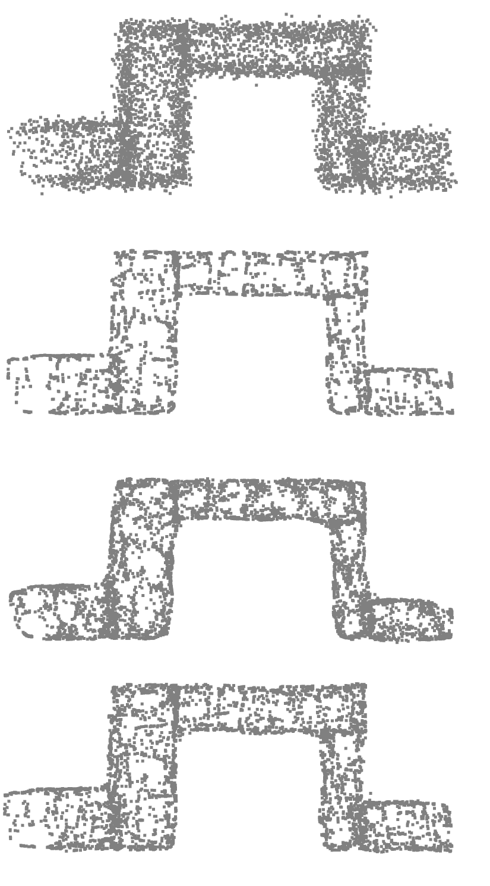
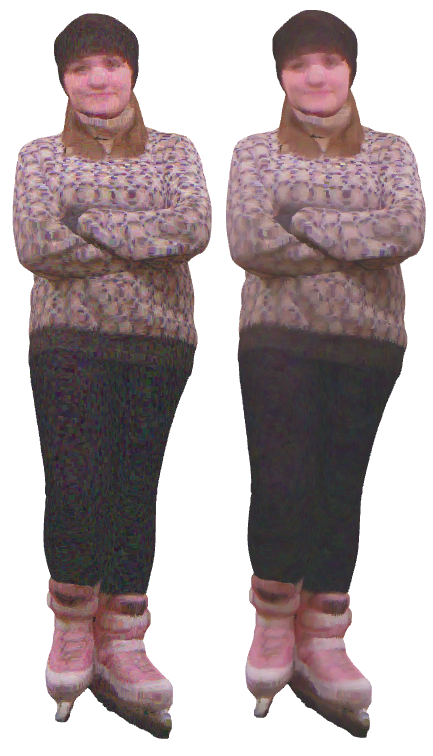

# Real world examples:
The following are the examples of denoising on real-world scans of Monument a Napoleon (Cherbourg) and Niki's serpent. First, non-squared data fidelity is used to remove the strong spatial outliers, and then isotropic TV filtering is used on the color channels. The time taken to process Napoleon pointcloud (500k points) is 37 seconds on NVIDIA 1080Ti.


# Graph_Signal_Processing
- This project implements *Total Variation* and *Tikhonov* regularization on graphs to process pointclouds.
- 
- It uses `torch_geometric` for fast processing on gpu.
- It is recommended to [render the notebooks here](https://nbviewer.jupyter.org/github/agitoz/Graph_Signal_Processing/tree/main/?flushed_cache=true).


# Installation
- One needs `faiss` for the graph construction.
- One needs `torch_geometric` for processing the signal on the graphs.
- Start by installing  [Miniconda](https://docs.conda.io/en/latest/miniconda.html).
- Activate the conda base environment using `conda activate`.
- Install `pytorch` and `faiss` in the conda environment using 
```
(base) $ conda install pytorch torchvision cudatoolkit=10.2 -c pytorch
(base) $ conda install -c pytorch faiss-gpu cudatoolkit=10.2
```
- You may need to change the cudatookit version. More details on above step are [here](https://pytorch.org/get-started/locally/) and [here](https://github.com/facebookresearch/faiss/blob/master/INSTALL.md).
- The next two steps *are important*.
- Install torch_geometric **inside the conda environment using the pip command, Not the `conda install` command**. Just follow the steps [here](https://pytorch-geometric.readthedocs.io/en/latest/notes/installation.html).
- To render the pointclouds locally, one needs open3d. Again, it is recommended to install open3d using the pip command **Not** the `conda-install` command.
```
(base) $ pip install open3d
```
# Cite
- The *Primal-Dual* algo implemented in this repo is the same as the one used to produce the results in the Section2 of [this paper](https://arxiv.org/abs/2103.16337).
- The paper argues that some variational-methods can be formulated as a Message Passing Networks which allows the use of graph machine learning libraries (like *torch_geo*, *dgl*) to solve inverse problems on graphs.
```latex
@misc{azad2021variational,
      title={Variational models for signal processing with Graph Neural Networks}, 
      author={Amitoz Azad and Julien Rabin and Abderrahim Elmoataz},
      year={2021},
      eprint={2103.16337},
      archivePrefix={arXiv},
      primaryClass={cs.LG}
}
```

